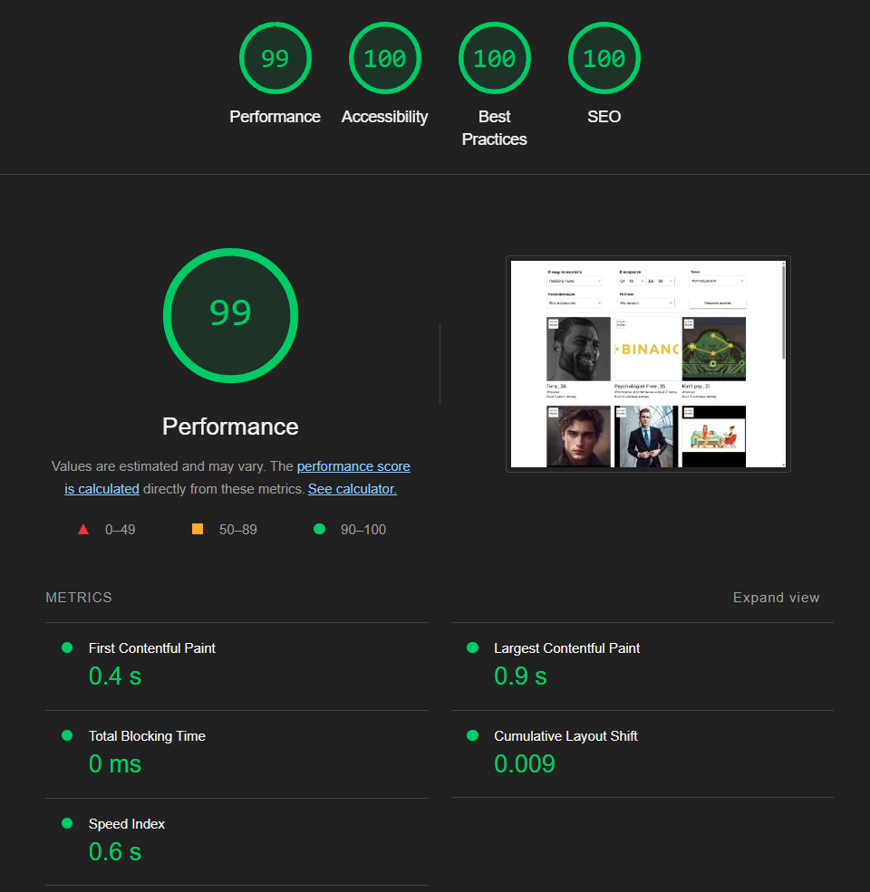

# Тестовое задание страница с поиском

## Запуск
1. `npm i` - установка пакетов
2. `npm run dev` - запуск режима разработки

Если нужна сборка она делается так:
1. `npm run build` - сборка проекта
1. `npm run preview` - запуск сборки

## О проекте

### Технологии
1. Основной фреймворк и кормилец - `React`
2. Сборщик - `Vite`
3. Стили - `Tailwind` с небольшой кастомизацией темы конкретно для этого проекта
4. `RTK` - для запросов, пагинации, нормализации, и стейт менеджер для ответов (для хранения значений фильтров по заданию используется query параметры)

### Архитектура
Проект хоть и небольшой но сделать в архитектуре [FSD](https://feature-sliced.github.io/).

### `app`
Для хранения функционала относящегося ко всему приложению

### `pages`
Для хранения страниц и все что с ними связанно. В нашем случае страница только одна поэтому там одна папка

### `feature`
Для хранения пользовательского взаимодействия. В данном случае туда хорошо подходят фильтры (если фильтры будут использоваться ещё где то то можно вынести в папку widgets) 

### `entities`
Для хранения бизнес сущностей. Часто эти сущности согласуются с сущностями бекенда. У нас это `specialist` и `subjects`.

### `shared`
Общие переиспользуемые компоненты. В сегменте `ui` тут хранится UI-kit который можно удобно заменить на какие либо библиотеки если потребуется.

### Прочее
#### Обрабокта ошибок
1. в файлах:
`src\entities\specialist\api\getSpecialists.ts`
`src\entities\subjects\api\getSubjects.ts`
описан функционал как можно симулировать ошибку запроса
2. В проекте используется ErrorBoundary чтобы страница продолжала работать при ошибках непосредственно в компонентах
3. есть `errorLogger.ts` через которого проходят все ошибки запросов, туда можно прикрутить `sentry`


#### Пагинация
Функционал "Показать ещё" работает, но без указания страниц это работает некорректно при перезагрузке страницы. Нужно добавлять ui отображения страницы с возможностью её смены.

#### Доступность
1. При раскрытии дропдауна логично переворачивать иконку стрелки, это можно сделать костыльно но при этом теряется возможность выбора селектора по табу и работы с ним через клавиатуру, я считаю что этот функционал важный для пользователя, особенно если речь идет про ресурс медицинской помощи.
Проблема решается либо полностью кастомным компонентом селекта на ui+li, либо подключением библиотек которые уже решили эту проблему.

2. Добавил логику чтобы между карточками тоже можно было перемещатсья через Tab. Если упарываться ещё сильнее можно настроить навигацию по карточкам через стрелки клавиатуры.

## Метрики
Чтобы проверить метрики нужно собрать проект `npm run build` и запустить сборку `npm run preview`

Для достижения СЕО в 100 нужно включать контрастный режим:
1. В хроме Ctrl+Shift+P набрать Rendering
2. Выставить опцию `Emulate CSS media feature prefers-contrast` в `more`

Метрика perfomance имеет значение от 97 до 100



## Что ещё хорошо было бы сделать:
1. Вынести все дефолтные значения для фильтров и размер пагинации в константы чтобы они не лежали в компонентах
2. Выпадающие селекторы вынести в реакт порталы чтобы их нельзя случайно перекрыть другими компонентами
3. Перейти на React 19, подключить compiler замерить количество ререндеров, удалить всю мемоизацию и замерить это ещё раз, таким образом проверить насколько круто команда реакта делает свою работу =)
4. Покрыть компоненты тестами
5. Прикрутить Storybook
6. Доработать шрифты чтобы избавиться от FOUT (Flash of Unstyled Text) эффекта
7. Подключить SSR к Vite для СЕО

# Оригинальное Задание

### Разработать небольшое SPA-приложение.

Необходимо использовать TypeScript, React, Redux и/или RxJS (желательно). Всё остальное остается на усмотрение разработчика, следуя практикам разработки React-приложений.
Необходимо разработать UI в соответствии с макетом Figma: 
https://www.figma.com/design/PHfAwHW92aUmY8a2qFwXXP/%D0%A2%D0%B5%D1%81%D1%82%D0%BE%D0%B2%D0%BE%D0%B5-%D0%B7%D0%B0%D0%B4%D0%B0%D0%BD%D0%B8%D0%B5-Freuders.com?node-id=0-1&p=f&t=EZYnqAyvYhicSjHM-0
  1. UI должен быть реализован под современные версии наиболее популярных браузеров;
  2. Используйте mobile-first подход;
  3. Если у специалиста отсутствует фото, то необходимо отображать аватар в зависимости от пола

Значения фильтров поиска необходимо хранить в query params

API для получения списка специалистов:
```
GET https://freuders-web-api-test-3.azurewebsites.net/api/search/specialists
// GET Params
{
  level: 0, // Уровень 0 - базовый 1 - премиум
  sex: 1, // М - 1, Ж - 2
  subjectId: 1 // Id темы консультации
  profSpeciality: 3, // 1 - Консультант, 2 - Сексолог, 3 - Коуч
  isCertified: true, // true/false — Есть/Нет диплом психолога
  ratingFrom: 0, // Нижнее значение рейтинга(для New 0)
  ratingTo: 0, // Верхнее значение рейтинга(для New 0)
  ageFrom: 18, // Нижнее значение при поиске по возрасту
  ageTo: 99, // Верхнее значение при поиске по возрасту
  filterType: 0, // Фильтрация 0 - Все, 1 - Онлайн, 2 - Избранные
  limit: 12, // Количество загружаемых элементов (обязательный параметр)
  offset: 0, // С какого элемента начинать загрузку (обязательный параметр)
}
```
```
// GET Response
{
  "data": {
    "items": [
      {
        "userId": "c218310a-9e2b-4447-ad52-7718b1e4577c",
        "name": "Михаил Владимирович",
        "sex": 1, // М - 1, Ж - 2
        "age": 35, // Возраст
        "birthDate": "2002-03-04T00:00:00", // Дата рождения
        "photoUrl": "https://dummyimage.com/512x512",
        "avatarId": "avatar-male-1",
        "level": 1, // Уровень 0 - базовый 1 - премиум
        "rating": 80, // Значение рейтинга(для New 0)
        "hasVideo": false, // Наличие видео
        "defaultSubjectName": "#семья", // Основная тема
        "subjectsCount": 0, // Количество дополнительных тем
        "isFavorite": false // В избранном
        "onlineStatus": 2, // 1 - Оффлайн 2 - Онлайн
        "lastActivityTime": "2023-10-08T09:28:24.2985824Z", // Время последней активности
      }
    ],
    "totalCount": 1 // Всего элементов
  }
}
```
API для получения списка тем:
```
GET https://freuders-web-api-test-3.azurewebsites.net/api/subjects
// GET Response
{
  "data": [
    {
      "id": 1,
      "name": "#семья",
      "sequence": 0
    },
    {
      "id": 2,
      "name": "#работа",
      "sequence": 0
    }
  ]
}
```

